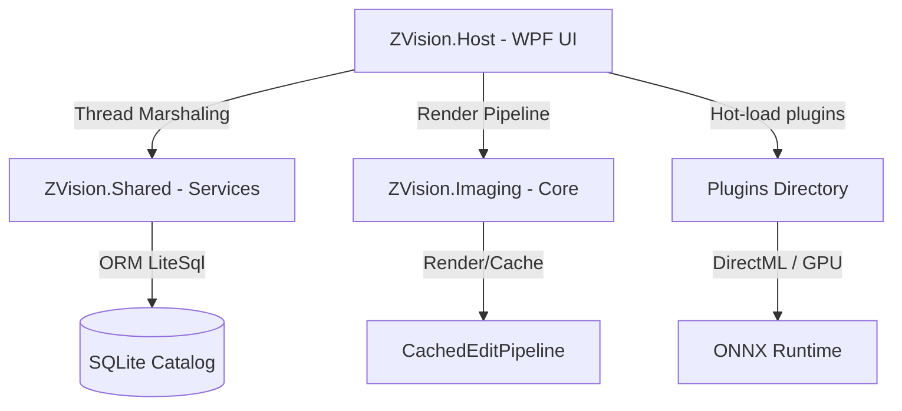
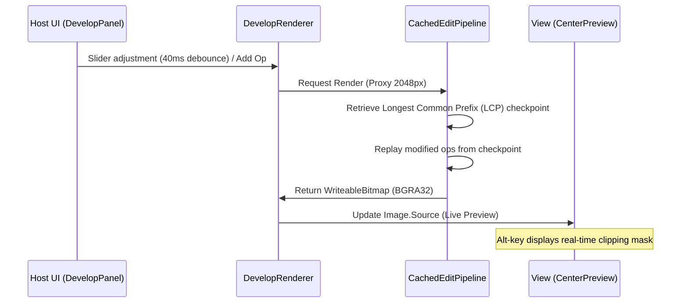

# 📘 System Architecture & Technical Documentation — ZVision

This document provides a comprehensive overview of the **ZVision** system architecture (WPF, .NET 8, ZeroUniverse ecosystem) and its evolutionary roadmap.

---

## 🏛️ 1. System Architecture

ZVision is structured around modular separation of concerns, decoupling the presentation layer from the 32-bit float linear-light image processing engine and out-of-process AI accelerators:

### Component Projects:
* **`ZVision.Core`**: Domain models, pipeline contracts, preset systems, and metadata abstractions.
* **`ZVision.Imaging`**: 32-bit float linear-light non-destructive image processing pipeline. Contains 40+ atomic edit operations (`IEditOp`), curve mathematics, color space transforms, and cached rendering DAGs (`CachedEditPipeline`).
* **`ZVision.Shared`**: High-performance services: SQLite Catalog (via LiteSql ORM), EXIF/GPS parser with memory caching (`ExifReader.GetOrCreate`), Stacking, Batch Export, and metadata indexing.
* **`ZVision.Host`**: Primary WPF desktop workstation. Hosts `CenterPreview`, `NavigatorPanel`, `DevelopPanel`, `Filmstrip`, and orchestrates AI plugins.
* **`ZVision.Plugins.*`**: Autonomous DirectML AI engines (`Upscaler`, `FaceRestorer`, `VisionTagger`) running in isolated process environments.
* **`ZVision.Tests`**: Automated unit and integration test suite (820+ passing tests).

---

## 🔄 2. Non-Destructive Rendering Pipeline

---

## 📍 3. Feature Implementations

### Desktop UI/UX & Professional Workstation Ergonomics
* [x] **Left Dock Navigator Panel**: Fixed top widget with ZeroUI `SegmentedControl` (`FIT`, `FILL`, `1:1`, `2:1`), live viewport rectangle tracking, and bi-directional real-time canvas pan/zoom.
* [x] **Library Metadata Drill-Down Bar**: 4-column filter bar (**Date (Year)**, **Camera**, **Lens**, **ISO**) with aggregate counts and in-memory EXIF caching.
* [x] **Interactive Masking Gizmos**: Direct on-canvas dragging for **Linear Gradient** (start/center/end bars + rotation axis) and **Radial Mask** (center handle + 4 perimeter dimension handles + feather ring).
* [x] **Virtual Copies (`Ctrl+'`)**: Zero-byte image branching with independent edit stacks and shared decoded memory proxies.
* [x] **Selective Copy Settings (`Ctrl+Shift+C`)**: Modular checklist dialog across 16 processing modules.
* [x] **Auto-Advance Culling (`Caps Lock`)**: Automated next-photo navigation upon rating/flagging/labeling.
* [x] **Panel Visibility Controls**: `Tab` (toggle side panels) and `Shift+Tab` (Pure Full Canvas mode).
* [x] **Lights Out Mode (`L`)**: 3-stage background dimming (Normal -> 80% Dim -> 100% Black).
* [x] **Interactive Histogram**: Hover zone highlight and drag adjustment for Blacks, Shadows, Exposure, Highlights, and Whites.

### Core Imaging & Performance
* [x] **40+ Non-Destructive Operations**: Full White Balance (Kelvin/Eyedropper/Auto), Tone Curves, 8-Channel HSL, Color Grading, Clarity, Dehaze, Levels, Local Masks (Gradient/Radial/Brush/Range/AI Subject/Sky).
* [x] **Pipeline Optimization**: LCP checkpoint caching, SIMD-accelerated linear-light mathematics, and non-blocking asynchronous preview dispatch.
